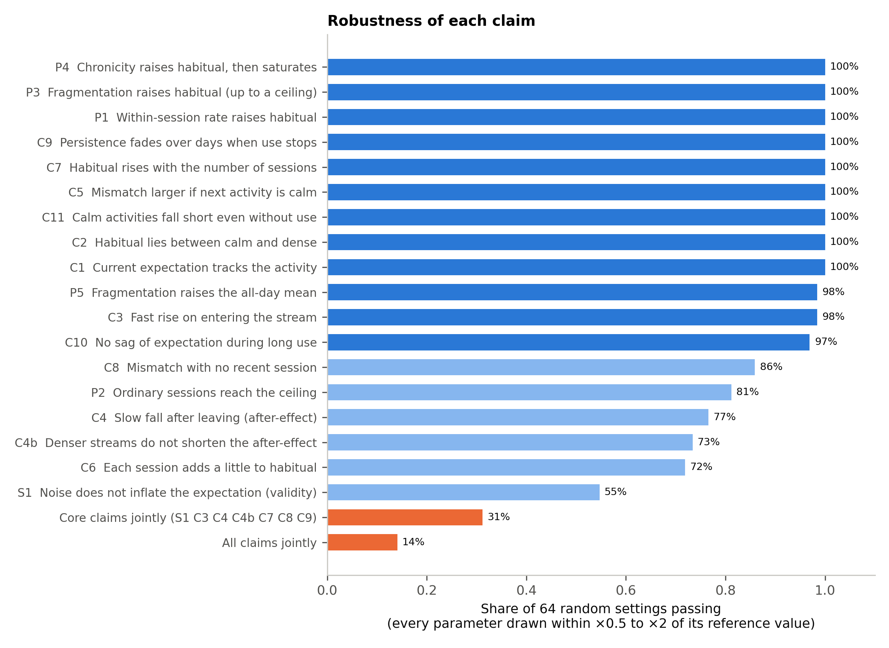
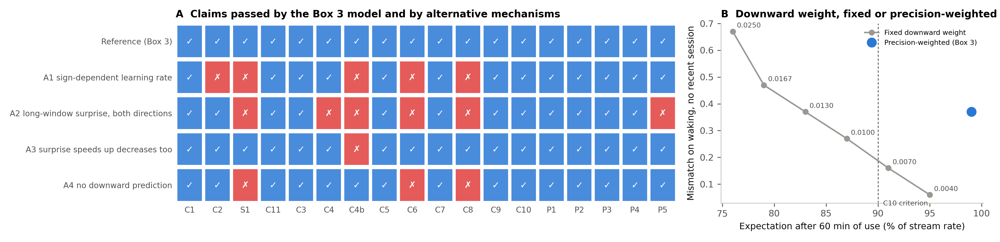
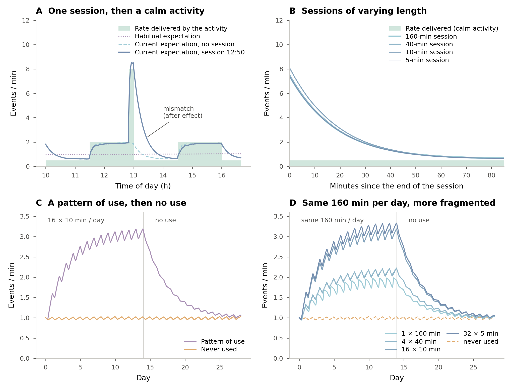

# Relevance Rate Model: simulations of Box 3 and Fig. 3

This repository supports Box 3 and Fig. 3 of the manuscript *A Relevance Rate Model of the affective mechanisms linking social media use to later attentional disruption* (Fournier, Pool, Sander & Dan-Glauser). It contains:

- the two-level model formalised in the box, written with the box's notation;
- a check of every claim the manuscript makes about this model;
- a robustness analysis, claim by claim and jointly;
- a comparison with the mechanisms the box does not adopt.

This is an illustrative model inspired by predictive coding. It is a proof of possibility: its weights depend on relative precision but are set rather than derived, and none of its values is measured. The simulations show what the proposed architecture implies under explicit assumptions, not what happens in people.

## The model

In interval $t$ of length $\Delta t$, the environment delivers $n_t$ concern-relevant stimuli, simulated as Poisson counts. The observed relevance rate is $R_t = n_t / \Delta t$. The **current expectation** $\mu_1$ concerns the ongoing activity. The **habitual expectation** $\mu_2$ concerns daily life as a whole and never receives $R_t$.

$$\delta_{1,t} = R_t - \mu_{1,t}, \qquad \delta_{2,t} = \mu_{1,t} - \mu_{2,t}, \qquad \mu_{2,t+1} = \mu_{2,t} + w_2\,\delta_{2,t}$$

$$\mu_{1,t+1} = \mu_{1,t} + w_1\,\delta_{1,t} - w_{\downarrow}\,\delta_{2,t}$$

| Weight | Rule | Code (`rrm/model.py`) | Reference |
|---|---|---|---|
| $w_1$ | high when surprise over the last few minutes reveals an **increase** in the rate and the current error is positive, low otherwise | `w1_high`, `w1_low` | 0.7, 1/20 |
| surprise | smoothed $\delta_1^2/(\mu_1/\Delta t)$, the squared error relative to the variance of a rate predicted at $\mu_1$ when events arrive at random (Poisson); the direction of change is the sign of the smoothed error | `surprise_threshold`, `surprise_smoothing` | 10, 0.3 |
| $w_{\downarrow}$ | larger in calm activities, smaller in dense ones, $w_{\downarrow,0}/(1 + \mu_1/\mu^\ast)$ | `w_down0`, `mu_star` | 1/20, 0.25 events/min |
| $w_2$ | small, so that $\mu_2$ changes over days | `w2` | 1/(3 × 1440) per min |

Two assumptions carry the model and are stated in the box:

1. **Asymmetric revision.** Negative errors are always revised slowly, even when surprising, because expectations about concern-relevant events resist downward revision. The main support is that extinction is slower for both threat- and positive-relevant stimuli than for neutral ones (Stussi, 2025). When relevance stems from reward, this matches the slower revision of reward-rate estimates when rewards become scarcer (Garrett & Daw, 2020; Palminteri & Lebreton, 2022). Relevance can also come from threat, so the reward literature is only a special case. Under a Poisson observer, leaving a dense stream is itself very surprising, so the slow fall does not follow from statistics alone.
2. **Transfer.** A single current expectation is carried from one activity to the next, without a context-specific reset. A context-specific expectation would shorten the after-effect.

Daily life (`rrm/scenarios.py`): night at 0.2 events/min, then waking hours alternating 90-min calm (0.5) and dense (2.0) activities. Stream: 8 events/min unless stated otherwise. Time step: 1 min.

**Two quantities are kept distinct.** The box's instantaneous error is $\delta_1 = R_t - \mu_1$. The **mismatch index** used in the results is the expected shortfall of the rate the activity delivers below the current expectation, $\max(\mu_1 - \lambda, 0)$. It is computed for each simulated trajectory, then averaged over trajectories and intervals, in events per minute.

## Claims checked

`scripts/01_check_claims.py` → `outputs/claims.md`, `outputs/claims.csv`. Reference parameters, 16 trajectories. **Core** claims are those the manuscript's argument rests on.

| ID | Claim | Core | Observed | |
|---|---|---|---|---|
| C1 | The current expectation follows the ongoing activity | | late in blocks, 0.61 in calm vs 1.88 in dense (true 0.5 vs 2.0) | ✓ |
| C2 | The habitual expectation concerns daily life as a whole | | 1.01, between calm and dense | ✓ |
| S1 | Poisson noise does not inflate the expectation (validity) | ✓ | 1.06 × the noise-free model | ✓ |
| C11 | A calm activity may fall slightly short of what is expected, even without use | | mismatch index 0.28 in calm activities, no noise | ✓ |
| C3 | Entering the stream is surprising, and the expectation quickly approaches the stream's rate (calibration) | ✓ | 2 min: 105% of the gap closed from a calm activity, 62% from a dense one | ✓ |
| C4 | After the stream is left, the expectation falls back only gradually (after-effect) | ✓ | 1/e decay in 19 min | ✓ |
| C4b | Leaving the stream is surprising too, but a denser stream does not shorten the after-effect | ✓ | 18 / 19 / 20 min after streams at 4 / 16 / 32 | ✓ |
| C5 | The mismatch is largest when the next activity is calm | | 4.08 vs 3.59 events/min, same session and preceding activity | ✓ |
| C6 | Each session adds a little to the habitual expectation | | isolated session +3.9%; one session a day for 28 days +12% | ✓ |
| C7 | The habitual expectation rises over days with the number of sessions | ✓ | 1.12 / 1.51 / 2.03 / 2.94 for 1 / 4 / 8 / 16 sessions a day | ✓ |
| C8 | A raised habitual expectation produces a mismatch with no recent session | ✓ | 0.37 vs 0.04 on waking, after 14 days of 16 × 10 min | ✓ |
| C9 | This persistence fades over days when use stops | ✓ | half-recovery 2.4 days | ✓ |
| C10 | The downward weight does not hold the expectation down during use | | 99% of the stream's rate after 60 min | ✓ |
| P1 | A higher within-session relevance rate raises the habitual expectation | | 1.29 / 2.03 / 3.46 for streams at 4 / 8 / 16 | ✓ |
| P2 | Ordinary sessions already reach the ceiling | | a 10-min session reaches the level of a 40-min one | ✓ |
| P3 | At equal total time, fragmentation raises the habitual expectation, up to a ceiling | | 1.79 / 2.06 / 2.94 / 3.11 for 1 × 160, 4 × 40, 16 × 10, 32 × 5 min | ✓ |
| P4 | Chronicity raises the habitual expectation, which then saturates | | 1.58 / 2.35 / 2.94 / 3.15 / 3.23 after 1 / 3 / 7 / 14 / 28 days | ✓ |
| P5 | At equal total time, fragmentation raises the current expectation averaged over the day | | 1.62 × for 16 × 10 vs 1 × 160 min | ✓ |

**Model property, reported for transparency (M1).** At equal number and length, sessions that overlap add *less* to the habitual expectation than spaced ones. With 8 sessions of 10 min a day, all within waking hours, gaps of 10 / 30 / 110 min give 1.49 / 1.81 / 2.04. A session that begins before the current expectation has fallen back is less surprising, and its after-effect overlaps the previous one. Close returns keep the *current* expectation elevated between sessions. The *habitual* expectation grows with the number of distinct sessions.

## Robustness

`scripts/02_robustness.py` → `outputs/robustness.csv`, `outputs/robustness_summary.csv`. Seven parameters (the four weights, the surprise threshold and smoothing, and $\mu^\ast$) are varied one at a time (× 0.5 and × 2). Then 64 settings are drawn log-uniformly within × 0.5 to × 2 of every reference value at once, with 8 trajectories each. `scripts/02b_conditions.py` → `outputs/robustness_conditions.csv`.



Claims taken one at a time mostly hold. **Jointly, they hold only within a region of parameter space**:

| Random settings | Core claims jointly |
|---|---|
| all | 20 / 64 (31%) |
| `w1_low` within × 0.7 to × 1.4 of reference | 15 / 31 |
| and surprise threshold ≥ × 0.8 | 14 / 20 |
| and surprise smoothing ≤ × 1.4 | 12 / 16 (75%) |

All 18 claims hold jointly in 14% of random settings. The conditions have a reading:

- **The after-effect (C4, C4b) requires a low `w1_low`.** Concern relevance must keep the current expectation precise. 100% of settings pass below the reference, against 41-48% above.
- **The absence of noise inflation (S1, 55% of settings) requires that `w1_low` not be too low, and that the surprise detector rarely fire by chance.** 78% of settings pass above the reference threshold, 31% below. With a low `w1_low`, each false alarm lasts longer. Persistence and accuracy therefore pull `w1_low` in opposite directions.
- **The limited effect of a single session (C6) requires a slow habitual level (`w2`).**

## What the box's choices do

`scripts/03_alternatives.py` → `outputs/alternatives.md`, `outputs/downward_weight_frontier.csv`.



| Alternative (one change from reference) | Fails | Why |
|---|---|---|
| A1 learning rate set by the sign of each error (same gains) | C2, S1, C4b, C6, C8 | intervals without events are under-weighted, so the expectation is inflated 1.9 × without any use |
| A2 long-window surprise, both directions | S1, C4, C4b, C6, C8, P5 | leaving the stream is detected and the expectation falls back within 1-4 min |
| A3 surprise speeds up decreases too (earlier version of the box) | C4b | after dense streams, leaving triggers fast revision: the after-effect lasts 18 min after a stream at 4, but 8 min at 16 and 1 min at 32 |
| A4 no downward prediction | S1, C6, C8 | without the hierarchy, no mismatch arises without a recent session |

**Downward weight (panel B).** Fixed downward weights trade the mismatch without a recent session (C8) against the tracking of the stream during use (C10). None of the fixed values examined (0.004 to 0.025), with other parameters at reference, passes every claim, whereas the precision-weighted weight obtains both. The weighting relaxes a trade-off, but it is not the only way to pass most claims. The conclusion depends on the mismatch index. With an index computed after averaging trajectories, a fixed weight of about 0.007 passes every claim, with a persistence effect about half as large.

## Model dynamics



Fig. 3 of the manuscript (file `fig1_dynamics`). A and B show the current expectation, which follows the stream within a session. C and D show the habitual expectation, to which each session adds only a little (dotted line in A).

- **A**, one 10-min session followed by a calm activity (C3, C4, C5).
- **B**, single sessions of 160, 40, 10 and 5 min, aligned on their end and followed by the same calm activity: the length of the session barely changes the after-effect (P2).
- **C**, habitual expectation during 14 days of 16 × 10 min per day, then 14 days without use (C7, C8, C9).
- **D**, the same 160 min per day, distributed as 1 × 160, 4 × 40, 16 × 10 or 32 × 5 min, for 14 days, then 14 days without use (P3).

The figure is drawn at its final printed width (6.8 in), so that LaTeX does not rescale its text. Curves average 128 (A, B) or 32 (C, D) simulated trajectories. C and D are lightly smoothed (centred 2-h moving average), which removes the steps left by individual sessions but keeps the daily cycle.

## Reproduce

```bash
python -m pip install -r requirements.txt
python run_all.py            # all outputs, about 5-15 min depending on the number of cores
python -m pytest tests       # unit tests of the model mechanics
```

`outputs/environment.txt` records the versions and run time of the last full run. All randomness is seeded.

## Layout

```
rrm/model.py         the model (Box 3 notation) and the alternative mechanisms
rrm/scenarios.py     daily-life schedules and patterns of use
rrm/claims.py        each claim as a simulation check; mismatch index; core claims
scripts/             01 claims, 02 robustness, 02b conditions, 03 alternatives, 04 figures
tests/               unit tests
outputs/             results (csv, md) and figures (png, pdf)
```

## Limitations

- Parameter values and activity rates are illustrative, not estimated from data. The criteria operationalise verbal claims and involve thresholds of our choosing.
- Weights are set or switched rather than derived from an explicit representation of uncertainty. They depend on relative precision but are not precisions themselves. The variance of observations, the uncertainty of expectations and environmental volatility are not modelled separately.
- The asymmetric revision and the transfer between activities are assumptions, not results. The simulations show their consequences, not their truth.
- Concern-relevant events are simulated as a Poisson process, whereas in practice they may be clustered. The surprise measure relies on this assumption.
- Without use, the mean expectation is about 1.14 × the true rate. About 6 points come from noise (S1). The rest comes from the downward prediction in calm activities and at night, which is the box's prediction C11 rather than a defect.
- The model stops at the mismatch and does not simulate its attentional cost.

## Citation and licence

See `CITATION.cff`. Code released under the MIT licence.
